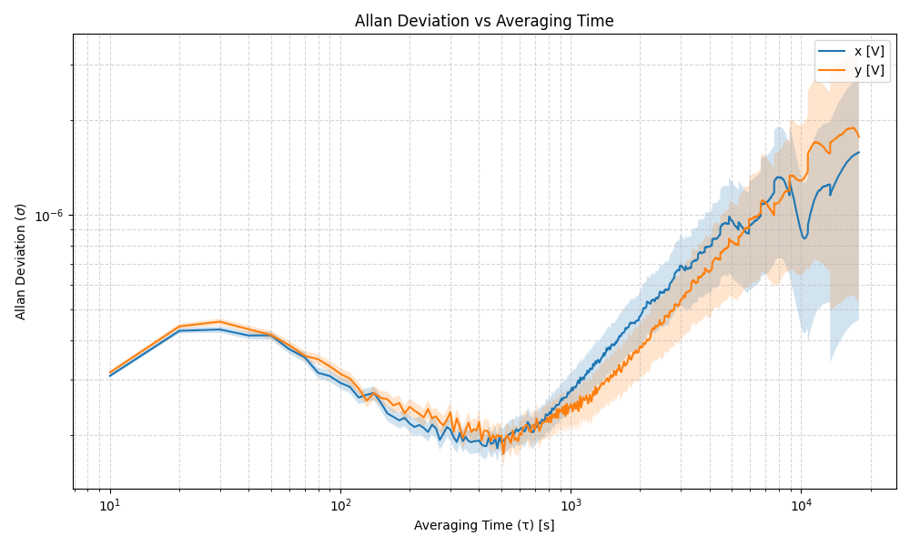

# Allan Deviation Calculator

This Python script calculates the Allan deviation for one or more time series stored in CSV files. It supports both normal and overlapping Allan deviation, generates plots, including uncertainty estimates and sample counts in the output.

## Features

- Calculates **normal** or **overlapping** Allan deviation
- Accepts **single** CSV input or **batch processing** of a folder
- Supports custom CSV **delimiter**
- Outputs CSV file with:
  - Allan deviation (`col`)
  - Error (`col_err`)
  - Sample count (`col_n`)
- Produces a log-log **plot** with shaded error bands
- Customizable averaging time mode: `all`, `octave`, or `decade`

## Plot example



## Requirements

- Python 3.x
- `pandas`
- `numpy`
- `matplotlib`
- `allantools`

Install dependencies:

```bash
pip install -r requirements.txt
```

## Usage

### Single file

```bash
python allan_deviation_calculator.py \
    --input_csv data.csv \
    -r 1 \
    -t overlapping \
    -c freq1 freq2 \
    --taus octave \
    --delimiter ";" \
    --output_dir results
```

### Batch mode

```bash
python allan_deviation_calculator.py \
    --batch_folder ./data \
    -r 1 \
    -t normal \
    -c signal1 signal2 \
    --taus decade \
    --delimiter ";" \
    --output_dir output
```

## Command-Line Arguments

```
usage: allan_deviation_calculator.py [-h] [--input_csv INPUT_CSV] [--batch_folder BATCH_FOLDER] [-r RATE]
                                     [-t {normal,overlapping}] -c COLUMNS [COLUMNS ...] [--taus {all,octave,decade}]
                                     [--delimiter DELIMITER] [--output_dir OUTPUT_DIR]

Calculate Allan deviation for one or many CSV files.

options:
  -h, --help            show this help message and exit
  --input_csv INPUT_CSV
                        Path to a single CSV file
  --batch_folder BATCH_FOLDER
                        Directory containing multiple CSV files
  -r RATE, --rate RATE  Sampling interval (seconds)
  -t {normal,overlapping}, --type {normal,overlapping}
                        Type of Allan deviation to compute
  -c COLUMNS [COLUMNS ...], --columns COLUMNS [COLUMNS ...]
                        List of column names for which to calculate Allan deviation
  --taus {all,octave,decade}
                        Tau values to use for Allan deviation calculation
  --delimiter DELIMITER
                        CSV delimiter (default: ';')
  --output_dir OUTPUT_DIR
                        Directory to save output CSVs and plots
```

## Output

For each input CSV:
- `*_adev.csv`: CSV file with tau, Allan deviation, error, and sample count
- `*_plot.png`: Log-log plot with error bands

## Author

alejandro.keller@fhnw.ch
